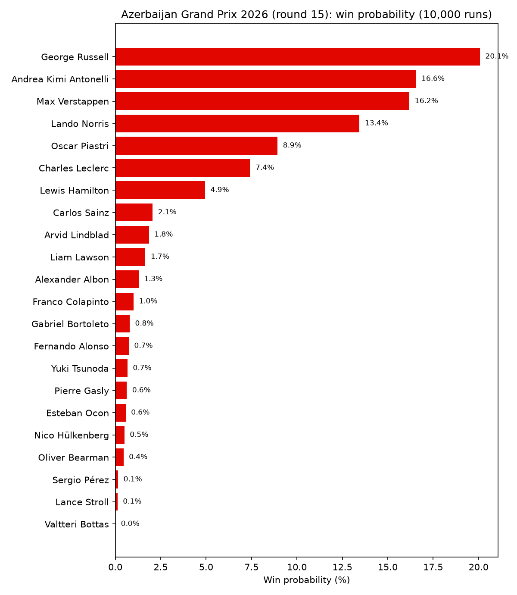
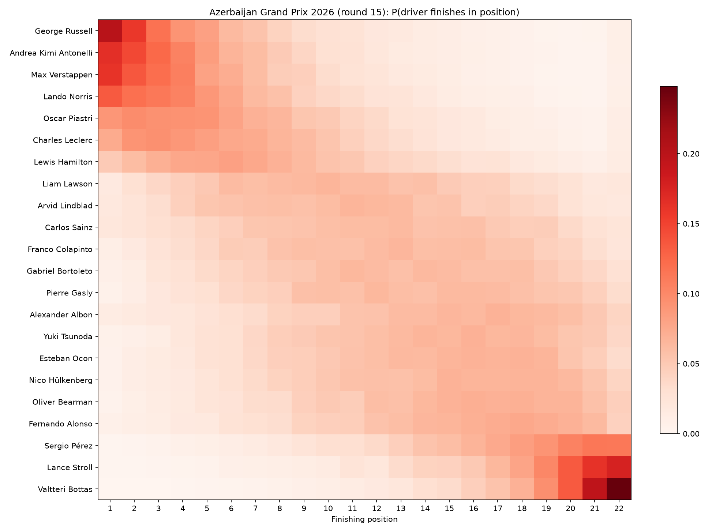
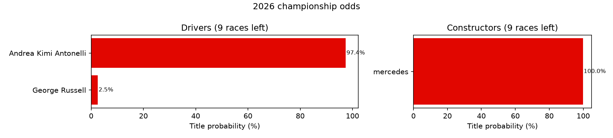
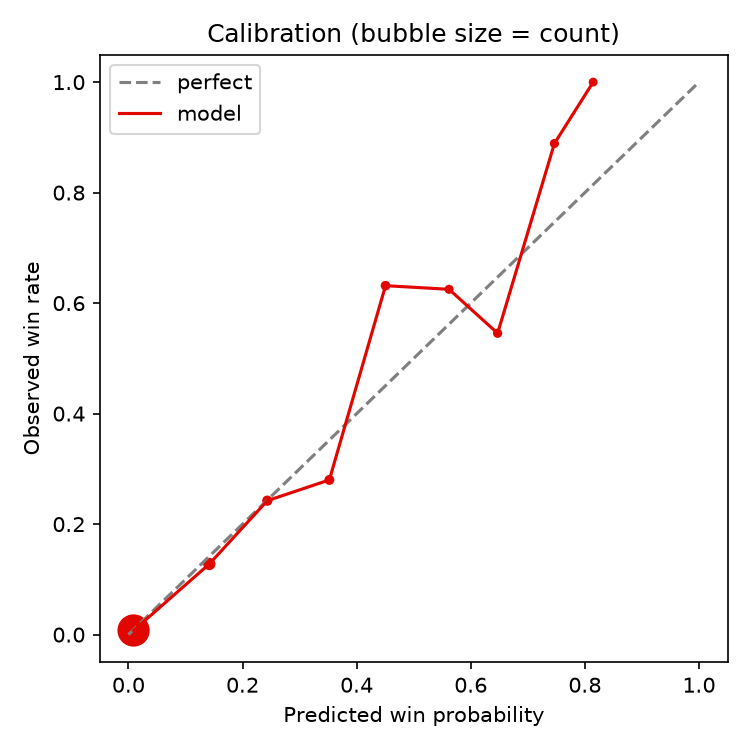

# f1-predictions

Race-by-race Formula 1 predictions from an Elo rating system and a Monte Carlo simulation.
Every driver and every constructor carries a rating learned from head-to-head results since
2010; a race is then simulated ten thousand times with shared team noise, individual driver
noise, a grid-position bonus and a per-driver retirement chance, and the finishing orders are
counted into win, podium, points and full position probabilities. A leakage-safe backtest
scores the model on past seasons against two baselines so the numbers below are honest.
Data comes from the Hugging Face dataset
[tracinginsights/RaceData](https://huggingface.co/datasets/tracinginsights/RaceData), a live
mirror of the Ergast schema.

## Example output

`f1pred predict --season 2026 --round 15`, run before qualifying (so without a grid):

```text
No qualifying data yet; running without grid
Rain chance: 10% (forecast)
                    Azerbaijan Grand Prix 2026 (round 15)
 #   Driver                    Win   Podium   Points   Exp. pos   P10-P90
 1   George Russell          20.1%    47.7%    87.2%        5.2      1-12
 2   Andrea Kimi Antonelli   16.6%    43.6%    87.2%        5.4      1-12
 3   Max Verstappen          16.2%    41.8%    86.7%        5.5      1-12
 4   Lando Norris            13.4%    36.6%    83.6%        6.0      1-13
 5   Oscar Piastri            8.9%    28.0%    78.3%        7.0      2-14
 6   Charles Leclerc          7.4%    26.1%    76.5%        7.3      2-14
 7   Lewis Hamilton           4.9%    18.1%    68.0%        8.5      2-16
 8   Carlos Sainz             2.1%     7.6%    41.6%       11.8      4-19
 9   Arvid Lindblad           1.8%     7.6%    46.1%       11.2      4-19
10   Liam Lawson              1.7%     8.4%    49.1%       10.9      4-18
11   Alexander Albon          1.3%     4.9%    29.3%       13.5      6-20
12   Franco Colapinto         1.0%     5.2%    39.2%       12.2      5-19
13   Gabriel Bortoleto        0.8%     4.4%    35.5%       12.7      5-20
14   Fernando Alonso          0.7%     2.9%    24.1%       14.3      7-21
15   Yuki Tsunoda             0.7%     2.7%    29.3%       13.6      6-20
16   Pierre Gasly             0.6%     3.7%    33.4%       13.1      6-20
17   Esteban Ocon             0.6%     3.2%    28.8%       13.6      6-20
18   Nico Hülkenberg          0.5%     3.0%    27.6%       13.8      6-20
19   Oliver Bearman           0.4%     2.6%    25.5%       14.1      7-21
20   Sergio Pérez             0.1%     0.9%    12.4%       16.5     10-22
21   Lance Stroll             0.1%     0.5%     6.8%       17.9     12-22
22   Valtteri Bottas          0.0%     0.2%     3.9%       18.9     14-22
                  * fewer than 5 rated races: low confidence
```

The rain line is the Open-Meteo forecast for the three hours from the race start; it becomes the
share of simulated runs that are wet. Before the forecast horizon, or when Open-Meteo cannot be
reached, the circuit's historical wet rate is used instead and the line says so.





### Championship odds

`f1pred season --season 2026`, run with nine races left, chains the race simulation over the
rest of the calendar 2,000 times and counts who ends up on top:

```text
           2026 drivers' championship (9 races left, 2,000 runs)
 #   Driver                  Points now   Exp. points    Title    Top 3
 1   Andrea Kimi Antonelli          292           391    97.4%   100.0%
 2   George Russell                 211           325     2.5%    94.8%
 3   Lando Norris                   186           285     0.1%    54.2%
 4   Lewis Hamilton                 191           271     0.0%    25.9%
 5   Charles Leclerc                167           256     0.0%    12.2%
 6   Max Verstappen                 145           256     0.0%    12.8%
 7   Oscar Piastri                  120           194     0.0%     0.0%
 8   Liam Lawson                     59            91     0.0%     0.0%
```



## How it works

**Ratings.** Each driver and each constructor starts at 1500. Every pair of classified
finishers in a race is one Elo matchup; the driver ahead scores 1, the driver behind 0, and both
ratings move by `K` times the surprise. Teammate matchups count double for the driver and not at
all for the constructor, because the car cancels out. Ratings regress toward 1500 at the start
of each season, constructors harder than drivers and harder still in rule-change years.
See [docs/elo.md](docs/elo.md).

**One simulated race.** A driver's performance is `driver + constructor + grid_bonus * (n - grid)`
plus one noise draw shared by both cars of the team and one private to the driver. Each driver
is retired with their own DNF probability and sent to the back; survivors are sorted by
performance. See [docs/monte-carlo.md](docs/monte-carlo.md).

**Monte Carlo.** That race is run 10,000 times as one NumPy matrix and the finishing orders
are counted: the share of runs a driver wins is their win probability, and the same counting
gives podium, points, expected position, its 10th and 90th percentiles, and a full
`P(driver finishes in position k)` matrix. Before qualifying the grid term is dropped and its
spread folded into the driver noise. See [docs/monte-carlo.md](docs/monte-carlo.md).

**DNF model.** Reliability is kept out of the Elo update. A driver's retirement chance blends
their recent DNF rate with their constructor's, shrinks it toward the field rate when the
evidence is thin, and scales it by the circuit's history, clipped to between half and double.
See [docs/dnf-model.md](docs/dnf-model.md).

**Season simulation.** Championship odds chain the same race simulation over every remaining
race and sprint, 2,000 times, adding points with that season's rules after each. Ratings are
held fixed within a simulated season, which under-estimates form swings and upgrades; the
fastest-lap bonus point (2019 to 2024) is not simulated. Drivers who have left the grid keep
their points, and constructor totals route each driver's simulated points to their current
team. See [docs/season-sim.md](docs/season-sim.md).

**Weather and track type.** `data update` asks [Open-Meteo](https://open-meteo.com/) how much
rain fell at each circuit in the three hours from the race start; 0.5 mm or more marks the race
wet. Every driver and constructor also carries a wet rating and one rating per hand-labelled
track type (street, high speed, high downforce, mixed), updated only on races of that kind and
shrunk toward the overall rating until there is enough evidence (eight races count for half).
For a future race the forecast rain probability becomes a coin flip inside every simulated run:
wet runs use the wet ratings, wider noise and higher DNF odds. When the forecast is out of
reach the circuit's historical wet rate stands in. See
[docs/weather-and-track.md](docs/weather-and-track.md).

## Backtest results

Parameters were tuned by coordinate descent on 2015 to 2022 (`f1pred tune`) with the weather
and track knobs in the grid. It chose `k_driver = 32`, `sigma_team = 40`, `grid_bonus = 12`,
`regress_constructor = 0.3`, `shrink_wet = shrink_track = 16`, and set both wet factors to 1.0
(no extra noise or DNF risk in the wet); the rest stayed at their defaults. The seasons below
were never seen by the tuner. Each race is predicted from the ratings, DNF rates, grid and
observed weather that were known before it started. See [docs/backtesting.md](docs/backtesting.md).

| Season | Races | Log loss model | Log loss pole | Log loss uniform | Brier model | Brier pole | Brier uniform | Spearman model | Spearman pole |
|-------:|------:|---------------:|--------------:|-----------------:|------------:|-----------:|--------------:|---------------:|--------------:|
| 2023 | 22 | 0.59 | 1.98 | 3.00 | 0.08 | 0.09 | 0.13 | 0.79 | 0.71 |
| 2024 | 24 | 1.74 | 2.89 | 2.99 | 0.08 | 0.09 | 0.13 | 0.80 | 0.78 |
| 2025 | 24 | 1.33 | 1.61 | 2.99 | 0.07 | 0.06 | 0.13 | 0.64 | 0.65 |

Log loss is the surprise at the actual winner (lower is better), Brier the squared error of the
podium probabilities (lower is better), Spearman the rank correlation of expected versus actual
finishing position (higher is better). The "pole" baseline gives the pole sitter a 90% win
chance and spreads the rest evenly; "uniform" gives every driver the same chance.

The model beats both baselines on winner log loss in every season and beats uniform on every
score. It is weakest where the grid already says most of what there is to say: in 2025 the
pole baseline edges it on podium Brier and Spearman. Driver form is not yet modelled.

### Did weather and track type help?

`f1pred backtest --seasons 2023-2025 --ablate` scores the same seasons with each addition
switched off and on, using the tuned parameters throughout (`base` is the Phase 3 model with
those parameters, so its numbers differ from the earlier Phase 3 README table, which used the
older tuning). Log loss is the winner score, Brier the podium score; lower is better for both.

| Variant | Log loss 2023 | 2024 | 2025 | All 70 | Brier 2023 | 2024 | 2025 | All 70 |
|:--------|--------------:|-----:|-----:|-------:|-----------:|-----:|-----:|-------:|
| base (neither) | 0.434 | 1.935 | 1.217 | 1.217 | 0.0806 | 0.0822 | 0.0682 | 0.0769 |
| weather | 0.442 | 1.905 | 1.240 | 1.217 | 0.0805 | 0.0805 | 0.0691 | 0.0766 |
| track | 0.568 | 1.679 | 1.280 | 1.193 | 0.0793 | 0.0802 | 0.0661 | 0.0751 |
| full (both, the default) | 0.594 | 1.736 | 1.327 | 1.237 | 0.0795 | 0.0812 | 0.0683 | 0.0763 |

Track type is the only addition that improves the 70-race averages, and it does so unevenly:
it cuts 2024's winner log loss from 1.93 to 1.68 but makes 2023 and 2025 worse. Weather is a
wash: the tuner pushed its knobs to the values that switch the wet noise and DNF scaling off,
and with only 52 wet races since 2010 the wet ratings move the average log loss by less than
0.001, so with both additions on the winner score is 0.02 worse than `base` while the podium
Brier and Spearman are marginally better. Phase 4 has not moved the headline numbers; both
features stay on by default because the podium and ordering scores favour them, but the
honest summary is that the grid and the overall ratings already carry most of the signal.



## Install and usage

```bash
uv sync
uv run f1pred data update                          # download tables into data/cache/, build the driver-race table
uv run f1pred ratings build                        # replay 2010 onward, write pre-race ratings, print the top 10
uv run f1pred predict --season 2026 --round 15     # or --race monza; saves outputs/2026-15-win.png and -positions.png
uv run f1pred season --season 2026                 # title odds for the rest of the season; saves outputs/2026-title.png and CSVs
uv run f1pred backtest --seasons 2023-2025         # score vs baselines; saves outputs/calibration.png and CSVs
uv run f1pred backtest --ablate                    # also score with and without weather and track type; saves outputs/ablation.csv
uv run f1pred tune                                 # coordinate descent on 2015-2022, held-out report, writes f1pred/tuned.json
```

Simulation commands take `--runs N`, `--seed N` and `--no-grid`; `predict` takes
`--rain 0.3` to override the rain probability; every command takes `--cache-dir DIR` and the
ones that write charts take `--out DIR`. `data update` fetches race-day rain from Open-Meteo
(no key needed) and caches it in `data/cache/weather.parquet`, so later updates only ask about
new races.

## Roadmap

Done: Phase 4, wet/dry weather via Open-Meteo and track-type conditional ratings, judged by
the ablation backtest (`f1pred backtest --ablate`).

- Phase 5: driver profile (aggression, risk, form) from lap-1 positions, DNF kinds and recent over-performance.

## Credits

Data: [tracinginsights/RaceData](https://huggingface.co/datasets/tracinginsights/RaceData),
derived from the Ergast and [Jolpica](https://github.com/jolpica/jolpica-f1) F1 databases.
Weather: [Open-Meteo](https://open-meteo.com/) historical archive and forecast APIs
(CC BY 4.0).

Prior art consulted: mar-antaya's `2025_f1_predictions` and `2026_f1_predictions`
(per-race gradient boosting on qualifying times); villekuosmanen's `F1Predict` (driver,
constructor and engine Elo with Monte Carlo perturbation, the closest relative of this design);
van Kesteren and Bergkamp 2023, JQAS (a Bayesian model showing constructors explain most of the
variance in results); Kevocado's `F1_Predictor` and neevj2006's `F1_Race_Predictor` (separate
reliability layer, shared team noise, leakage-safe backtests).

## License

MIT. See [LICENSE](LICENSE).
